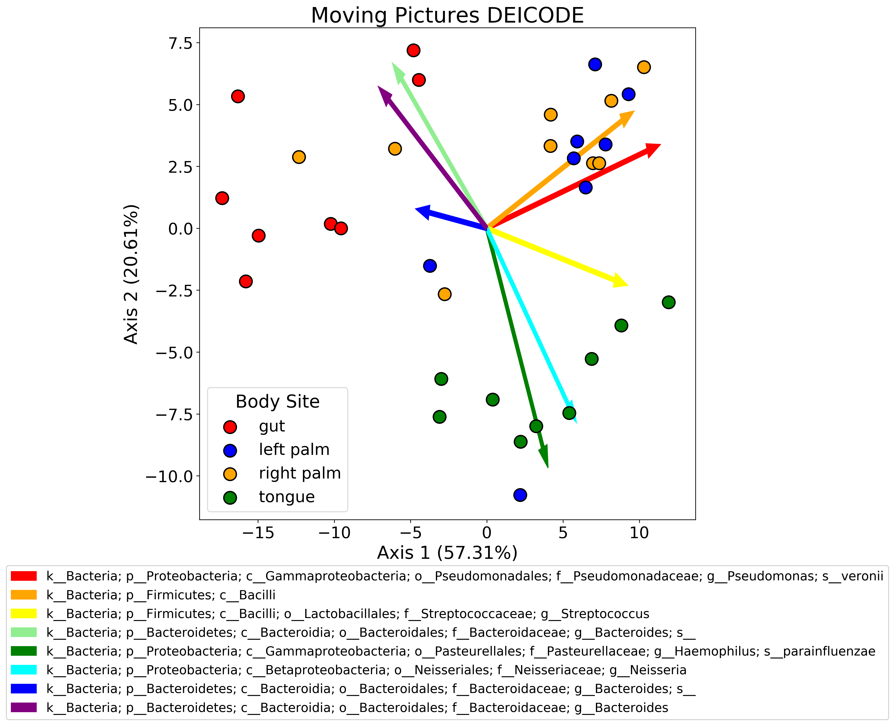

EDIT (03/10/2020): Plot and code updated to appear better on screen.

One of the things I find myself doing fairly frequently is plotting biplots. A biplot is basically a principle components analysis (PCA) plot + a loading plot. When you perform PCA, you typically plot the samples in the first two or three PCs. What you can also do is plot the features of your dataset to see how strongly each one contributes to the PCs. When you combine these two plots, you get a powerful visualization. In my research area, these are often used to see which features (usually microbes) are driving separation of samples by some biological variable (diet, genotype, etc.).

Usually these come in the form of `.qza` files from Qiime which are just fancy wrappers for `skbio` [ordination results](http://scikit-bio.org/docs/0.5.1/generated/generated/skbio.stats.ordination.OrdinationResults.html) in this case. I've found that plotting the samples in PC space is not super straightforward - typically (at least in Qiime), the [q2-emperor](https://github.com/qiime2/q2-emperor) tool is used to view the biplot. This is a great tool, and I like it a lot, but it's not super useful for publication-ready figures (at least in my opinion!). I like to fiddle around with matplotlib a lot - looking at plot layouts, axes, colors, etc. You can certainly download the emperor plots as `.png` or `.svg` files, but editing these after the fact is not really my style.

I wrote some skeleton code to process ordination results and plot them that I've outlined below. I'm going to be use the `ordination.qza` file from the [DEICODE tutorial](https://forum.qiime2.org/t/robust-aitchison-pca-beta-diversity-with-deicode/8333) written by my friend Cameron Martino. If you are not using a `.qza` file, feel free to ignore that part of the code.



```python
import matplotlib.pyplot as plt
import numpy as np
import pandas as pd
from qiime2 import Artifact
from skbio.stats.ordination import OrdinationResults


def reconstruct_comp(
    ord_results: OrdinationResults,
    axis: str = "samples",
) -> pd.DataFrame:
    """Reconstruct principle coordinates from PCoA.

    Parameters:
    -----------
        ord_results: skbio.stats.ordination.OrdinationResults
        axis: whether to reconstruct samples or features (default='samples')

    Returns:
    --------
        pc_data: pandas DataFrame of samples or features by PCs

    NOTE: If axis = 'features' then ord_results must be from a biplot
    """

    if axis not in ["samples", "features"]:
        raise(ValueError("axis must be 'samples' or 'features'"))
    dim = len(ord_results.eigvals)

    if axis == "samples":
        axis_df = ord_results.samples
    if axis == "features":
        axis_df = ord_results.features

    evals = np.zeros([dim, dim])
    np.fill_diagonal(evals, ord_results.eigvals.iloc[:dim])
    pc_data = pd.DataFrame(np.dot(axis_df.iloc[:, :dim], evals))
    pc_data.columns = ["Axis_{}".format(x+1) for x in range(dim)]
    pc_data.index = axis_df.index

    return pc_data


ordination = Artifact.load("ordination.qza")
ordination = ordination.view(OrdinationResults)

taxonomy = Artifact.load("taxonomy.qza")
taxonomy = taxonomy.view(pd.DataFrame)

metadata = pd.read_csv(
    "sample-metadata.tsv",
    sep="\t",
    index_col=0,
    skiprows=[1],
)

# reconstruct sample axes
sample_axes = reconstruct_comp(ordination, axis="samples")
sample_axes = sample_axes.join(metadata)

# reconstruct feature axes
feature_axes = reconstruct_comp(ordination, axis="features")

# order features in order of decreasing magnitude
feature_axes["magnitude"] = feature_axes.apply(np.linalg.norm, axis=1)
feature_axes = feature_axes.sort_values(by="magnitude", ascending=False)
feature_axes = feature_axes.join(taxonomy)

color_dict = {
    "gut": "red",
    "left palm": "blue",
    "right palm": "orange",
    "tongue": "green",
}
sample_axes["color"] = sample_axes["BodySite"].map(color_dict)

fig, ax = plt.subplots(1, 1, figsize=(10, 10))

for site, color in color_dict.items():
    ax.scatter(
        x=sample_axes[sample_axes["BodySite"] == site]["Axis_1"],
        y=sample_axes[sample_axes["BodySite"] == site]["Axis_2"],
        c=color,
        s=200,
        edgecolor="black",
        linewidth=1.5,
        label=site,
        zorder=1,
    )

sample_legend = ax.legend(
    loc="lower left",
    title="Body Site",
    title_fontsize=20,
    fontsize=18,
)
ax.add_artist(sample_legend)

feature_color_dict = {
    0: "red",
    1: "orange",
    2: "yellow",
    3: "lightgreen",
    4: "green",
    5: "cyan",
    6: "blue",
    7: "purple"
}

# display top 8 features
arrows = []
for i in range(8):
    a = ax.arrow(
        x=0,
        y=0,
        dx=feature_axes.iloc[i]["Axis_1"],
        dy=feature_axes.iloc[i]["Axis_2"],
        width=0.2,
        color=feature_color_dict[i],
        zorder=0,
        label=feature_axes.iloc[i]["Taxon"],
    )
    arrows.append(a)

feature_legend = plt.legend(
    handles=arrows,
    fontsize=14,
    bbox_to_anchor=[0.5, -0.25],
    loc="center",
)
ax.add_artist(feature_legend)

prop_explained = ordination.proportion_explained.tolist()
ax.set_xlabel(
    "Axis 1 ({}%)".format(round(prop_explained[0]*100, 2)),
    fontsize=20,
)
ax.set_ylabel(
    "Axis 2 ({}%)".format(round(prop_explained[1]*100, 2)),
    fontsize=20,
)
ax.set_title("Moving Pictures DEICODE", fontsize=24)
ax.tick_params("both", labelsize=18)

plt.savefig("sample_plot.png", dpi=300, bbox_inches="tight")
```
