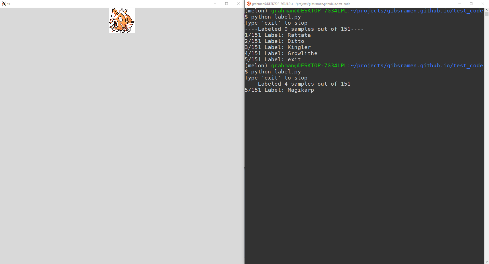

I've been working on a personal project for the last couple of days that involves some level of image classification. The project itself I'll post later but I wanted to share some code I wrote to generate a labelled training set. I wanted a way to display an image for which I could manually type a label that saves the image-label combination to a document. The dataset I'm currently dealing with has nearly 2000 images so I wanted to streamline the process as much as possible. To address this problem, I wrote some code that does this without switching windows to the opened image. This allowed me to manually label images incredibly rapidly.

Additionally, I figured it would be useful to allow the option of labelling images piecewise. I wrote the code such that you could stop before all labels were applied and pick back up again later. Note that in this instance I am randomly choosing the image at each iteration. In practice you may want to select a set of images more representative of your whole dataset. A screenshot of how it works can be seen below.



This code snipped requires both the PIL and numpy packages. I wrote this code for use on the Windows Subsystem for Linux (Ubuntu) showing the images with ImageMagick. For this example I downloaded the [Generation I Pokémon sprites](https://veekun.com/dex/downloads) provided by Veekun and labeled them by Pokémon name.

```python
import glob
import os

import numpy as np
from PIL import Image
from PIL.ImageTk import PhotoImage
from tkinter import Tk, Label

# use tkinter for showing images
# other methods I tried switched focus to the image window each
# time a new image was shown
root = Tk()
l = Label(root)
l.pack()

img_files = glob.glob("pokemon/main-sprites/red-blue/*.png")
num_files = len(img_files)

print("Type 'exit' to stop")

# write labels to a file as they're provided
outfile = "manual_labels.tsv"
if not os.path.exists(outfile):
    with open(outfile, "w+") as f:
        f.write("#Image\tLabel\n")

# if the file already exists read what's already been labeled
with open(outfile, "r") as f:
    data = f.read().splitlines()[1:]

# only pick from images that haven't already been labeled
already_labeled = set([x.split("\t")[0] for x in data])
missing_labels = set(img_files).difference(already_labeled)
i = len(already_labeled)

print(f"----Labeled {i} samples out of {num_files}----")
with open(outfile, "a") as f:
    while missing_labels:
        i += 1
        # randomly choose an image from the unlabeled ones
        this_file = np.random.choice(tuple(missing_labels))
        img = Image.open(this_file).resize((100, 100))
        img = PhotoImage(img)
        l.config(image=img)
        label = input(f"{i}/{num_files} Label: ")

        if label == "exit":
            break

        f.write(f"{this_file}\t{label}\n")
        missing_labels.remove(this_file)
```
