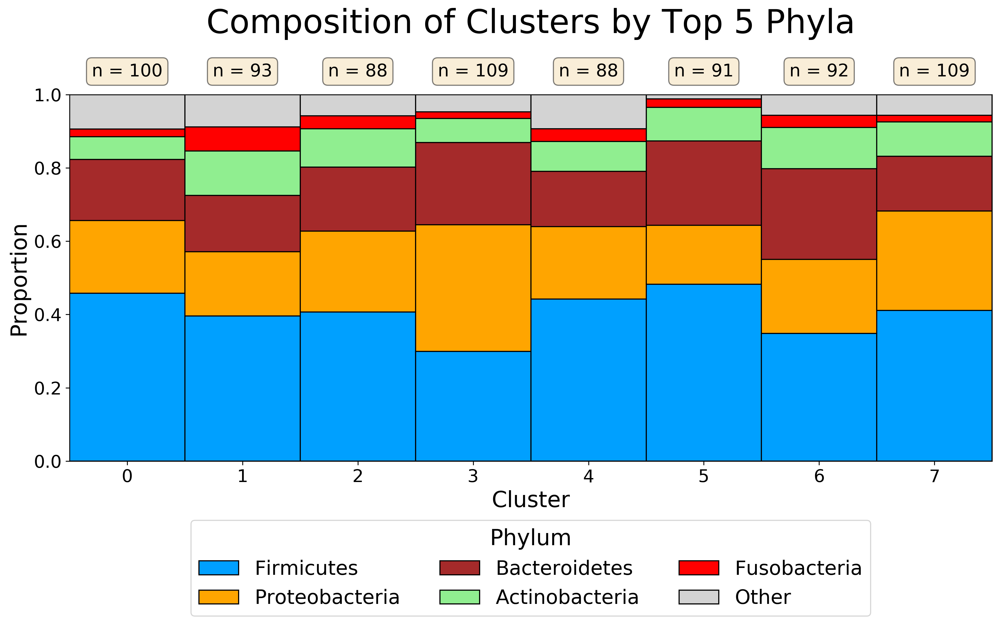

EDIT (06/01/2020): Fixed typo where I wrote "taxon" instead of "cluster."

One thing I've found myself doing recently is working with cluster of features (microbes, metabolites, etc.). When performing unsupervised clustering on biological features, it is important to ensure that the clusters you find have some sort of biological meaning. Otherwise you've just segmented features into arbitrary spaces.

What I've taken to doing is plotting the taxonomic composition of each of these clusters at some level (usually Phylum). By doing this, I can get a quick overview of how these clusters look at the specified taxonomic level. I can then see, for example, if any of the clusters have a higher proportion of some specific Phylum. This can serve as a (very!) preliminary indication that your clustering may be extracting some interesting biological meaning.

For this example, I am using the moving pictures dataset from the Qiime2 tutorial. Additionally, I am randomly assigning each feature to a cluster rather than performing an actual clustering. This is a lot easier, as the purpose of this snippet is the visualization rather than the clustering itself.



```python
import matplotlib.pyplot as plt
import numpy as np
import pandas as pd
from qiime2 import Artifact, Metadata

table = Artifact.load("table-deblur.qza")
table_df = table.view(pd.DataFrame)

metadata = Metadata.load("sample-metadata.tsv")
metadata_df = metadata.to_dataframe()

taxonomy = Artifact.load("taxonomy.qza")
taxonomy_df = taxonomy.view(pd.DataFrame)

# break each taxonomy assignment into constituent levels
for tax in "kpcofgs":
    search_string = f"{tax}__([^;]*)?"
    tax = taxonomy_df["Taxon"].str.extract(search_string)
    taxonomy_df[f"{tax}__"] = tax

taxonomy_df = taxonomy_df.replace("", np.nan)

# randomly assign each feature into a random cluster
n_clusters = 8
np.random.seed(42)
random_clusters = np.random.randint(
    low=0,
    high=n_clusters,
    size=cluster_df.shape[0]
)
cluster_df = taxonomy_df.copy()
cluster_df["cluster"] = random_clusters

# get the proportion of each phylum in each cluster
phylum_props = cluster_df.groupby(by=["cluster", "p__"]).size()
phylum_props = phylum_props.unstack(fill_value=0)
phylum_props = phylum_props.apply(lambda x: x / x.sum(), axis=1)

# sort phyla by total abundance in dataset and use top 5
top_phyla = cluster_df.groupby("p__").size()
top_phyla = top_phyla.sort_values(ascending=False)
top_5_phyla = top_phyla.head(5).index.tolist()

colors = ["#00a0ff", "orange", "brown", "lightgreen", "red"]
color_dict = {p: c for p, c in zip(top_5_phyla, colors)}

# characterize all phyla outside of top 5 as aggregate "Other"
comp_df = phylum_props.copy()
all_phyla = comp_df.columns
not_top_5_phyla = set(all_phyla).difference(set(top_5_phyla))
not_top_5_phyla = list(top_5_phyla)
comp_df["Other"] = comp_df[not_top_5_phyla].sum(axis=1)
comp_df = comp_df.drop(columns=not_top_5_phyla)
comp_df = comp_df[top_5_phyla + ["Other"]]

fig, ax = plt.subplots(1, 1, figsize=(15, 6))

def_color = "lightgray"

# for each phylum, plot on top of previous phyla
for i, col in enumerate(comp_df.columns):
    ax.bar(
        np.arange(n_clusters),
        comp_df[col],
        bottom=np.sum(comp_df.values[:, :i], axis=1),
        label=col,
        color=color_dict.get(col, def_color),
        edgecolor="black",
        width=1,
        linewidth=1,
    )

for i, cluster in enumerate(np.arange(n_clusters)):
    ax.text(
        x=i,
        y=1.05,
        s=f"n = {list(random_clusters).count(cluster)}",
        ha="center",
        fontsize=16,
        bbox=dict(boxstyle='round', facecolor='wheat', alpha=0.5)
    )

ax.set_ylabel("Proportion", fontsize=20)
ax.set_xlabel("Cluster", fontsize=20)
ax.set_title(
    "Composition of Clusters by Top 5 Phyla",
    fontsize=30,
    y=1.15,
)
ax.set_ylim([0, 1])
ax.set_xlim([0-0.5, n_clusters-0.5])
ax.set_xticks(range(n_clusters))
ax.tick_params("both", labelsize=16)

ax.legend(
    bbox_to_anchor=[0.5, -0.45],
    loc="lower center",
    fontsize=18,
    ncol=3,
    title="Phylum",
    title_fontsize=20,
)

plt.savefig(
    "phyla_composition_plot.png",
    dpi=300,
    bbox_inches="tight",
)
```
