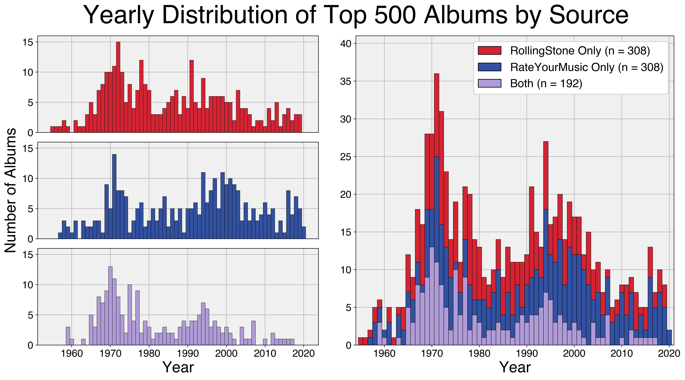

One of my hobbies (if you can even call it that) is browsing the [RateYourMusic](https://rateyourmusic.com/) charts for hours on end. I find it a great way to find new music, especially albums that may not pop up on my radar otherwise. Recently, RollingStone published an updated version of their "500 Greatest Albums of All Time" [list](https://www.rollingstone.com/music/music-lists/best-albums-of-all-time-1062063/) so I thought it would be interesting to compare the albums in each list.

I manually downloaded the webpages for both the RYM charts and the RollingStone list. I am, of course, aware that I could have scraped the webpages directly but I actually got banned from RYM a while back for doing so as it is against their TOS. After appealing they graciously unbanned me so I decided to respect their wishes. I used the Python package [BeautifulSoup](https://www.crummy.com/software/BeautifulSoup/bs4/doc/) as well as some brute force regex to extract the position, artist, album name, and year from both sources. Additionally, for the RYM entries I also extracted the average rating, number of ratings, number of reviews, and primary genres as that data was immediately available.

Some of the albums/artists have slight differences (i.e. Eno vs. Brian Eno) so there was some legwork I had to do to make sure I was accurately reporting which albums were which. I used the [`difflib`](https://docs.python.org/3/library/difflib.html) module that comes with Python to look for similarities between the artist and album for each album that was *not* immediately identifiable in both RYM's and RS' list. With some hacky use of the `SequenceMatcher` function I *think* I was able to find most of the albums shared between the two sources. There's always the possibility that I made a mistake so please let me know if you find one!

The first visualization I made was a yearly distribution of the albums by source. I looked at which albums were in common between the two lists (n = 192) and which ones were unique to one or the other (n = 392 for both). I then plotted a stacked barplot of the number of albums that appear per year based on the source. The overall distribution shows a bimodal pattern with clear peaks in the early 70s and mid-90s. Looks like both lists underappreciate the synthpop/new-wave jams of the 80s.

The other visualization I did looks at the differences in position of some of the albums by the "top" artists. I aggregated both lists to find which artists had the most albums shared between the two sources. For all artists that had at least 4 albums shared (n = 9), I plotted the positions of these albums between RYM and RS. I also used the [Discogs API](https://www.discogs.com/developers) to download the album covers for these albums to show them in the order RollingStone has them. Interesting that The Beatles positions barely differ between the two. I will say that RollingStone *criminally* underrates In Rainbows. In my opinion it is the best Radiohead album and should be at least in the top 50.

I may end up doing more analyses on this dataset but that's it for now!

[GitHub](https://github.com/gibsramen/rym_vs_rolling_stones_top_500) link to repository with data, code, & notebook.
