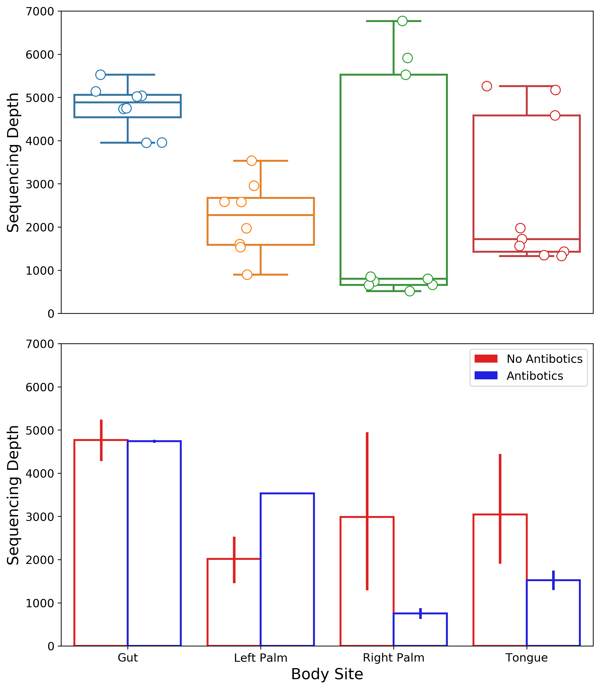

Recently a collaborator of mine asked that I edit one of my figures such that the inside of the boxplot was white but the outsides were colored corresponding to their respective categories. The inverse of this is straightforward: use `sns.boxplot` and set the `hue` parameter to the data category of interest. However, the inverse is a bit harder because there is no `edge_hue` option - there is only a single `edgecolor` parameter available to change in the `seaborn` API. It took some Googling but I figured out how to solve this task.

I came across [this](https://stackoverflow.com/questions/36874697/how-to-edit-properties-of-whiskers-fliers-caps-etc-in-seaborn-boxplot/36893152#36893152) StackOverflow answer that served as the jumping-off point for this snippet. The basic premise is to plot the data "normally" (with the `hue` option) and then iterate through the components of the figure that need to be changed. What this component is called depends on the type of plot: points are `collections`, boxplots are `artists`, etc. It is also worth noting that visualizations featuring extra lines (such as the whiskers in a boxplot or the error bars in a barplot) must also be changed this way.




```python
import matplotlib.pyplot as plt
import pandas as pd
from qiime2 import Artifact
import seaborn as sns

table = Artifact.load("../data/table-deblur.qza")
table_df = table.view(pd.DataFrame)
meta = pd.read_csv(
    "../data/sample-metadata.tsv",
    sep="\t",
    skiprows=[1],
    index_col=0,
)

depths = table_df.sum(axis=1).to_frame()
depths = depths.rename(columns={0: "depth"})
meta = meta.join(depths)

body_sites = sorted(meta["body-site"].unique())
fig, axs = plt.subplots(2, 1, figsize=(10, 12), sharex=True)
plt.subplots_adjust(hspace=0.1)

sns.boxplot(
    data=meta,
    x="body-site",
    order=body_sites,
    y="depth",
    linewidth=2,
    ax=axs[0],
)

sns.stripplot(
    data=meta,
    x="body-site",
    order=body_sites,
    y="depth",
    s=10,
    linewidth=1,
    jitter=0.3,
    ax=axs[0],
)

# adapted from https://tinyurl.com/y5cvdnbp
# box lines
for i, box in enumerate(axs[0].artists):
    color = box.get_facecolor()
    box.set_edgecolor(color)
    box.set_facecolor("white")

    # iterate over whiskers and median lines
    for j in range(6*i, 6*(i+1)):
        axs[0].lines[j].set_color(color)

# scatter points
for coll in axs[0].collections:
    color = coll.get_facecolor()
    coll.set_edgecolor(color)
    coll.set_facecolor("white")

sns.barplot(
    data=meta,
    x="body-site",
    order=body_sites,
    y="depth",
    hue="reported-antibiotic-usage",
    hue_order=["No", "Yes"],
    palette={"No": "red", "Yes": "blue"},
    linewidth=2,
    ax=axs[1],
)

handles, labels = axs[1].get_legend_handles_labels()
axs[1].legend(
    handles,
    ["No Antibotics", "Antibotics"],
    loc="upper right",
    fontsize=12,
)

# barplots & error bars
for patch, line in zip(axs[1].patches, axs[1].lines):
    color = patch.get_facecolor()
    patch.set_edgecolor(color)
    patch.set_facecolor("white")
    line.set_color(color)

for ax in axs:
    ax.set_ylim([0, 7000])
    ax.set_ylabel("Sequencing Depth", fontsize=16)
    ax.tick_params("y", labelsize=12)

axs[0].xaxis.set_visible(False)
axs[1].set_xticklabels([x.title() for x in body_sites], fontsize=12)
axs[1].set_xlabel("Body Site", fontsize=16)

plt.savefig("vbl_edge_colors.png", dpi=300, bbox_inches="tight")
```
